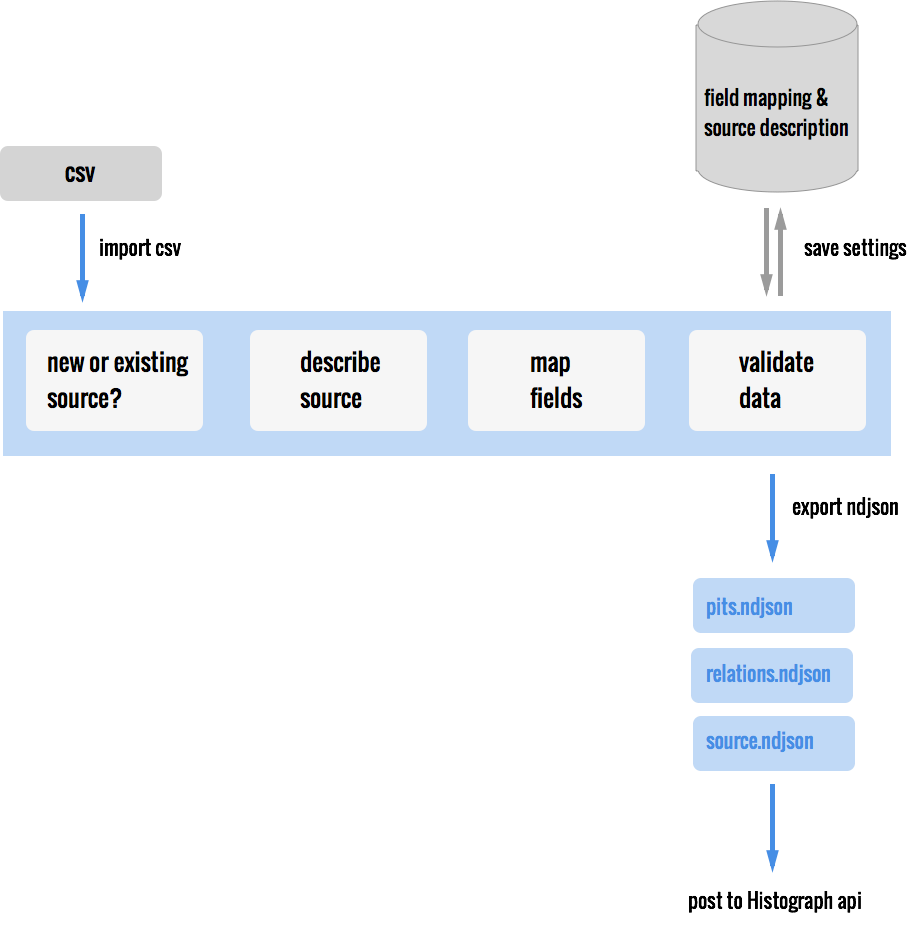

#Pipo - Pit Importer Part One
 
The tool to create valid ndjson files to upload to the Histograph Core
 

## INSTALLATION INSTRUCTIONS

1. git clone this repository to a directory
2. In a terminal: move into your directory 
3. Download Composer

    `curl -sS https://getcomposer.org/installer | php`

3. And run `php composer.phar install`
4. Create a database based on the file: `sql/pipo.sql`
5. Rename the `./app/config/parameters.php.dist` to parameters.php and change the configuration settings for db, email etc. according to your setup
6. Create a virtual host or point your browser to the location you set up for this site
7. Composers post install script should have created the following dirs and made them writeable for the web server:
    app/storage/cache, app/storage/log, app/storage/uploads
If the last step failed do this manually:
    `sudo chmod 777 app/storage/cache app/storage/log app/storage/uploads`
8. On going to production; change the run mode in `/web/index.php` to use the http_cache 

## DOCUMENTATIE

De data importer vervangt de custom scripts die nu voor elke dataset gemaakt worden om csv naar ndjson om te zetten. Elk teamlid moet dit proces in het vervolg eenvoudig kunnen doorlopen.

- upload csv
- map velden naar ontologie histograph
- valideer data waar nodig (datums, geojson)
- beschrijf de bron (naam, url, licentie, beschrijving, bewerkingen, etc)
- sla alle mappings en bronbeschrijving op in database
- opslaan data zelf in database niet nodig
- exporteer ndjson files voor pits, relaties en bron

